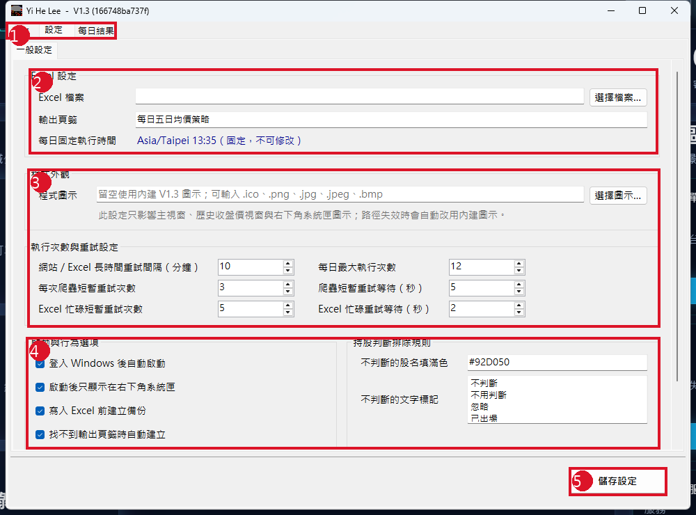

# Yi He Lee 使用者操作手冊

版本：V1.3　｜　文件日期：2026-07-20　｜　適用對象：一般使用者

## 1. 系統用途與重要原則

Yi He Lee 是 Windows 系統匣常駐工具，用來讀取已設定的客戶持股 Excel，取得官方 TWSE／TPEx 收盤價與均線資料，並依下列唯一條件顯示通知結果：

```text
進場價／平均價 > MA20
AND
現價 < MA5
```

兩項必須同時成立；相等時不觸發。MA60、MA120 只供保存與顯示，不參與通知。現價由 Excel 的 DDE 欄位提供；程式不會用官方收盤價替代無效現價。

## 2. 開始前準備

1. 將發布資料夾放在可寫入的位置，例如桌面、文件或 D 槽；不要放在 `C:\Program Files`。
2. 準備要讀取的 Excel 檔案，並確認您有寫入與儲存權限。
3. 開啟 Excel 與看盤軟體（若現價欄使用 DDE），兩者與 Yi He Lee 應以相同 Windows 權限執行。
4. 首次啟動後，於「設定」選擇 Excel 檔案並儲存。

程式會在 exe 同一資料夾建立 `settings.json`、`Data`、`Logs`、`Backups`。請不要手動刪除 `Data` 或 `settings.json`，除非您確定要重設歷史與設定。

## 3. 主要畫面與設定



1. **主要頁籤**：操作、設定、每日結果。關閉主視窗只會縮回系統匣，不會結束程式。
2. **Excel 設定**：使用「選擇檔案」指定完整 Excel 路徑；輸出頁籤預設為「每日五日均價策略」。
3. **重試設定**：網站或 Excel 暫時忙碌時依此設定重試；不建議任意調高每日執行次數。
4. **啟動與持股排除**：可設定登入 Windows 自動啟動、備份、輸出頁籤自動建立，以及排除色碼與文字標記。
5. **儲存設定**：修改後必須按「儲存設定」才會生效。

## 4. 每日操作流程

### 4.1 盤中判斷（09:00～13:30）

在「操作」頁按「立即執行盤中判斷」。此功能只讀取已保存的均價資料與 Excel 現價，不抓官方收盤資料，也不寫入 Excel。適合在 DDE 現價變動後立即檢查。

### 4.2 收盤更新（13:35 後）

在「操作」頁按「立即執行收盤更新」，或等待固定的 Asia/Taipei 13:35 自動排程。程式會更新官方收盤價與 MA5／MA20／MA60／MA120，保存結果，並將七欄技術資料寫入「每日五日均價策略」。

### 4.3 Excel 更新前確認

開始前請：按 Enter 或 Esc 結束儲存格編輯、關閉另存新檔／列印／尋找取代等對話框、不要在更新時關閉 Excel、不要重新命名或刪除輸出頁籤。程式會先備份再寫入；成功驗證後才儲存活頁簿。

## 5. Excel 資料要求

程式掃描除「總表」與「每日五日均價策略」以外的客戶頁籤。有效持股表需能辨識：代號／代碼、股名／名稱、進場價／平均價、現價；張數為選填。股票代碼會以文字處理，`0050`、`00631L`、`00982A` 等前導零與英文字尾都必須保留。

以下情況會略過：表頭含「出場價」或「出場日」的已出場區塊，或列中含「不判斷」「不用判斷」「忽略」「已出場」「暫停判斷」等標記。可另以設定中的填滿色輔助排除。

輸出頁籤只有七欄：代碼、名稱、收盤價、5日均價、20日均價、60日均價、120日均價。客戶、DDE 現價與診斷資訊不會寫入該頁籤。

## 6. 如何閱讀每日結果

完成後主視窗會切至「每日結果」。請依頁籤查看：

- **均價資料異常**：均價前置資料不足或異常。
- **符合通知條件**：進場價／平均價 > MA20 且現價 < MA5 的持股。
- **進場價／平均價異常**：進場價／平均價空白、0、負數、錯誤值或無法解析。
- **現價異常**：DDE 現價空白、#N/A、0、負數或無法解析。
- **無法判斷**：找不到當日技術資料，或 MA5／MA20 缺少。

只要任何必要值無效，程式不會觸發通知，也不會把另一個欄位或官方收盤價拿來代替。

## 7. 歷史收盤價

按「歷史收盤價」可查詢已保存的官方資料、依市場／股票／日期篩選、手動回補資料，並與鉅亨網清單做交叉驗證。交叉驗證僅供參考；正式均價來源仍是 TWSE／TPEx 官方每日收盤價。

## 8. 系統匣操作

右下角 Yi He Lee 圖示提供：立即執行盤中判斷、立即執行收盤更新、設定、開啟設定的 Excel、歷史收盤價、開啟 Log、重新啟動與結束。雙擊圖示可顯示主視窗；要完全結束程式，請使用系統匣選單的「結束」。

## 9. 常見問題

| 狀況 | 處理方式 |
|---|---|
| Excel 找不到或無法寫入 | 確認設定的完整路徑、活頁簿不是唯讀／受保護檢視，並以與程式相同權限開啟 Excel。 |
| 現價顯示異常 | 開啟看盤軟體並確認 DDE 連線；確認 Excel 現價欄不是 #N/A、空白、0 或負值。 |
| 沒有通知 | 確認兩個嚴格條件都成立；其中任一項不成立或相等都不會通知。 |
| 均價資料不足 | 新上市、停牌或歷史資料未足時屬正常，請查看均價資料異常與缺少原因。 |
| 網站未更新／休市 | 程式不會拿昨天資料冒充今天；請等待下一次重試或下一交易日。 |
| 程式視窗關掉了 | 視窗可能已縮到系統匣，雙擊右下角圖示即可叫回。 |

## 10. 聯絡支援前請準備

請提供：程式版本與 Commit SHA、操作日期與時間、Excel 完整路徑（可遮蔽敏感資料）、發生步驟、每日結果畫面、相關 Log 檔案，以及是否以系統管理員身分開啟 Excel／程式。不要提供帳號、密碼或完整客戶敏感資料。
